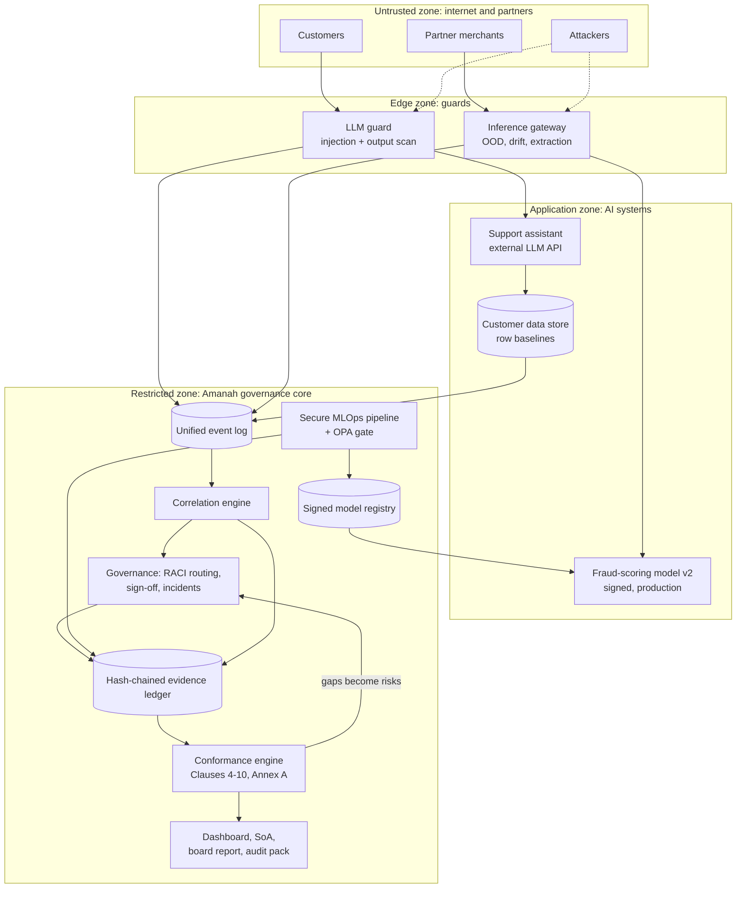
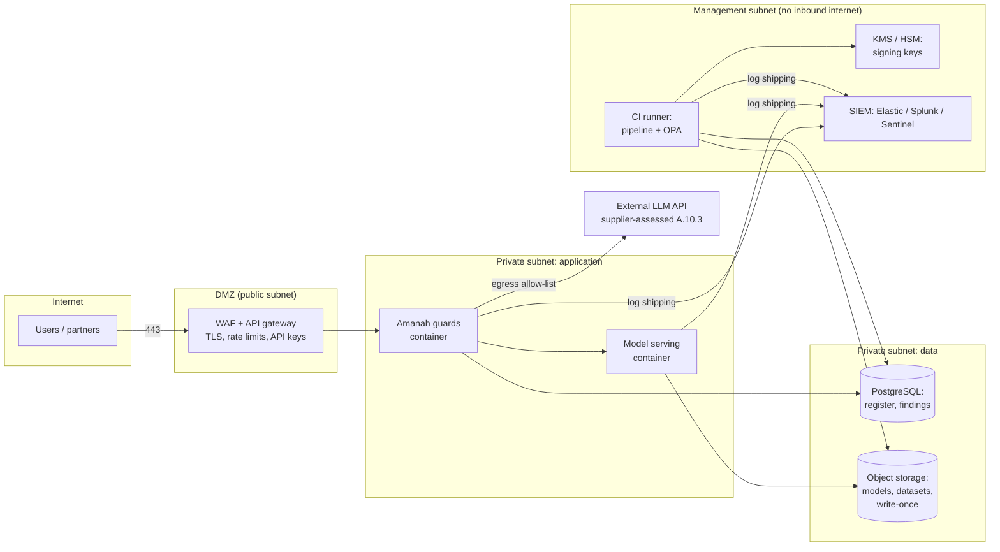
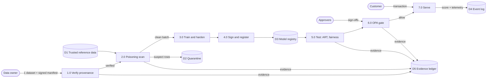
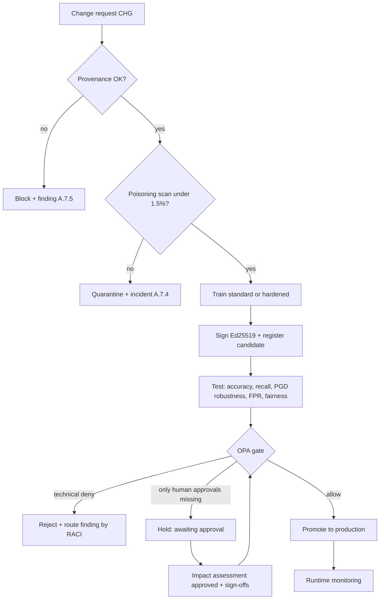
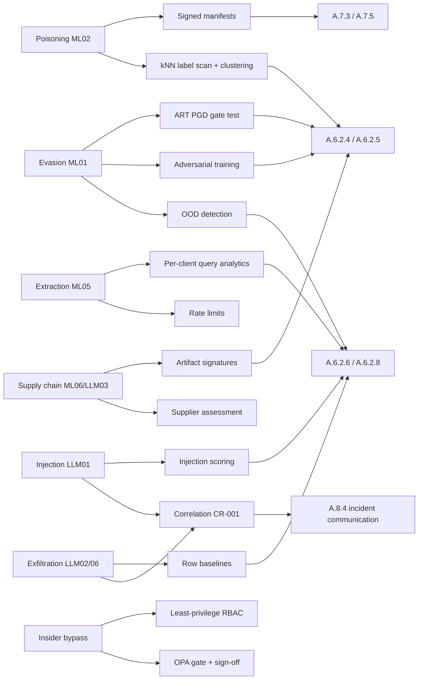
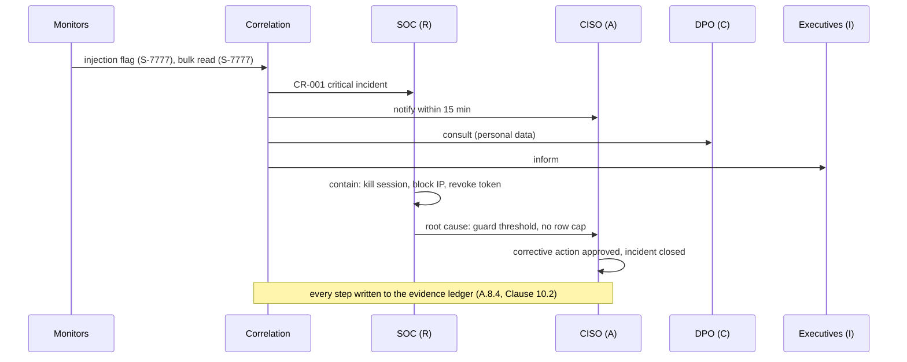

# Amanah architecture

The exam guide (section 2.2) asks for six kinds of diagram. All six are below, written in
Mermaid, so they render on GitHub, in VS Code, and on mermaid.live, and can be edited live.

## 1. System architecture

Four layers. Each AI system sits behind a guard that writes to one event log. The governance
core reads that log and the evidence ledger, and never talks to customers directly.

## 2. Network and deployment (cloud, hybrid or on-premises)

Cloud: each zone is a VPC subnet with security groups. On-premises: VLANs and firewalls.
Hybrid: the governance core and keys stay on-premises; serving runs in the cloud.

## 3. Data flow (DFD level 1) with trust boundaries

Trust boundaries are crossed at steps 1 (external data in), 7 (customer input in) and at the
external LLM API. Every crossing is verified (signature, guard) and logged.

## 4. Process flow: model release

## 5. Security architecture: controls against each threat

Defence in depth: each threat meets at least two independent controls, so one failure is not
a breach. Example from the demo: the injection guard let a 0.75-score message through by design,
and correlation with the data-store baseline caught it.

## 6. Incident workflow (RACI)

## Design decisions and trade-offs (RQF Level 6)

| Decision | Alternative | Why this choice | Cost accepted |
|---|---|---|---|
| Adversarial training for the fraud model | Input sanitisation only | Cuts evasion from 60.3% to 14.6% at the gate strength | False alarms rise from 0.9% to 3.1%; analysts absorb it; the gate caps it at 5% |
| Flag, not block, borderline injections (0.35-0.80) | Block everything suspicious | Real customers write messy messages; over-blocking hurts service | A borderline attack gets through once; correlation catches it within the window |
| Policy-as-code (OPA/Rego) | Gate rules in Python | Rules are auditable, versioned, unit-tested, owned by risk not engineering | One more component; mitigated by a parity-tested built-in fallback |
| Hash-chained evidence ledger | Plain database table | Auditor can verify nothing was edited after the fact | Corrections must be new entries, never edits |
| NumPy model wrapped as an ART estimator | PyTorch | Runs on any CPU laptop; ART attacks are unchanged | Swap the adapter for PyTorchClassifier in production |
| SQLite + file keys | PostgreSQL + KMS | Zero-setup single node for v1 | Must migrate for multi-node and key custody |
| Graph export (Cypher) | Live Neo4j dependency | Works offline; Neo4j optional | Blast-radius queries run in NetworkX until Neo4j is connected |

## Failure and recovery

| Failure | Detection | Recovery |
|---|---|---|
| OPA binary missing or crashes | Policy engine falls back | Built-in evaluator applies the same rules (parity tested) |
| Model file corrupted or swapped | Signature check on every load | Load refused; previous signed production version keeps serving |
| Evidence row edited | `amanah verify` recomputes the chain | Exact entry reported; restore from backup; incident raised |
| Monitor floods with false positives | Alert counts on dashboard | Thresholds live in config/platform.yaml, change goes through sign-off |
| Critical incident open | Gate rule (Clause 10.2) | New releases for that system blocked until incident closed |
| Poisoned batch reaches storage | Scan before training | Batch quarantined; model never trained on it |

## Scalability

Guards are stateless per request except per-client counters, which move to Redis when scaled
horizontally. The event log ships to a SIEM that already scales. Pipeline runs are independent
jobs in CI. Robustness tests are the heaviest step (a few seconds here) and parallelise per epsilon.
